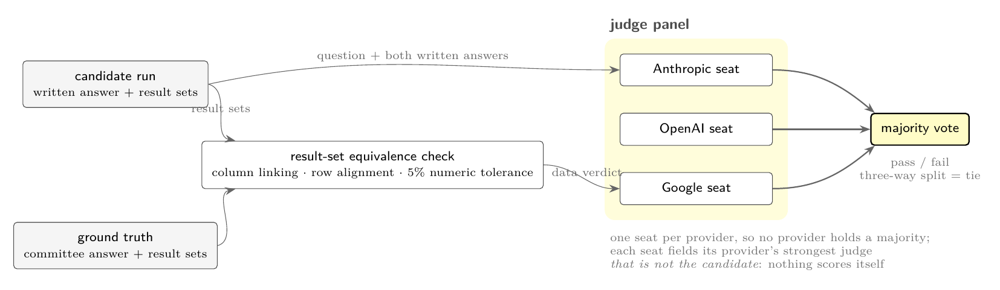

# data-agent-mnist

**Turn your own data warehouse into a benchmark for analytical agents.**

There is no single best model for everyone. Which one is right depends on your
schema, your join depth, and the questions your people actually ask, and a public
leaderboard cannot tell you any of that. This is the machinery for building the
benchmark that can: it takes your warehouse and your questions and produces a
scored board, with ground truth you did not have to hand-write.

## Why not an existing benchmark

Text-to-SQL benchmarks translate one question into one query against a schema
handed to the model up front, and score a string match against a single gold
query. A decade of them rests on those assumptions. Agentic analytics breaks all
of them: the agent discovers the schema itself, takes as many turns as it needs,
issues several queries, and is judged on whether it answered the question rather
than on how it phrased the SQL.

The difficulty also lives somewhere those benchmarks do not look. It is in the
size and multi-hop join structure of a real warehouse, not in a compact
hand-built schema. A benchmark that abstracts the schema away measures the wrong
thing, which is why this one is built to run against yours.

So it is designed for three properties:

| | |
|---|---|
| **personalised** | your questions, your data, your warehouse. The output is which model is right *for you*, not a global ranking. |
| **schema-aware** | the real schema, at its real width and join depth, because that is where the difficulty is. |
| **replayable** | every evaluation runs against an identical warehouse state, from one command, which a live production system cannot promise. |

## How it works

Four stages. You supply a warehouse and a set of questions; the harness supplies
everything after that.

**1. A replayable warehouse.** Deterministic seeding from committed data, so every
run scores against identical state. If your questions came from production
traffic they will name real entities, so the seeder plants each referenced entity
under exactly the identifier its question uses, then buries it in a synthetic
population. Present but not conspicuous: a question whose referent is missing is
unanswerable, and one that is the only row in the table is trivial.

**2. Ground truth without an answer key.** Real questions do not arrive with
validated answers, and hand-authoring SQL over a wide warehouse neither scales
nor produces anything better than one person's opinion. Instead several models
from different providers each solve every question independently, running the
full agentic loop. Where at least two agree by independent paths, that result
becomes ground truth; where all disagree, the question is dropped as not reliably
answerable. Provider diversity is the point: two labs' models agreeing
independently is much harder to explain away as shared training bias.

**3. Scoring by a panel, not a judge.** One seat per provider, and the panel
excludes the candidate's own model family, so nothing scores itself and no
provider holds a majority. A deterministic equivalence check runs first and its
verdict reaches the panel as an authoritative data signal, because two correct
answers can disagree on form: one names a column `total_dollar_usage`, the other
`monthly_spend`. In our own run, 84.9% of scored result sets matched only through
that linked mapping.



**4. A board.** Pass rate with standard errors and paired difference tests, plus
analyses for failure modes, judge bias, turn-budget ceilings, contamination, and
whether models find the dimensional layer or stop at the flat one.

## The repository is the harness, not the benchmark

It ships no questions, no warehouse and no results beyond the two worked
examples. What is here is the machinery, so the method can be inspected,
criticised and pointed at a warehouse of your own.

## Getting started

Python 3.13 and [uv](https://docs.astral.sh/uv/). Three API keys, each a direct
signup with no cloud account attached.

```bash
uv sync

export OPENAI_API_KEY=...
export ANTHROPIC_API_KEY=...
export FIREWORKS_API_KEY=...
export DAM_MODELS_CONFIG=$PWD/config/models.example.yaml
export DAM_DATA_ROOT=$PWD/examples/saas/out        # any writable path

# 1. build the example warehouse (loads committed CSVs into chDB, ~1s, no network)
uv run examples/saas/seed_example.py

# 2. ground truth: three models answer independently, majority agreement wins
uv run 05_annotate.py \
  --questions examples/saas/questions.jsonl \
  --db-path examples/saas/warehouse --system-prompt examples/saas/schema.md \
  --probe-table marts.usage_daily --snapshot-column day \
  --out examples/saas/out/annotated.jsonl --no-classify

# 3. score every candidate against it
uv run 06_eval.py \
  --annot examples/saas/out/annotated.jsonl --out examples/saas/out/results.jsonl \
  --db-path examples/saas/warehouse --system-prompt examples/saas/schema.md \
  --probe-table marts.usage_daily --snapshot-column day --no-verify-db

# 4. the board
uv run 08_results_stats.py \
  --results examples/saas/out/results.jsonl --annot examples/saas/out/annotated.jsonl
```

Steps 2 and 3 call models, so they cost money: 8 questions by 3 annotators, then
8 by 7 candidates plus a 3-judge panel on each. A few cents and a few minutes.

Step 1 and the test suite (`uv run pytest tests -q`) reach no provider, so the
keys above can stay as placeholders, but they still need `DAM_MODELS_CONFIG` and
`DAM_DATA_ROOT`: the modules resolve a registry and a data root at import.
There is deliberately no default registry, so importing without one tells you to
supply it rather than quietly running the example catalog as though it were
yours. `.github/workflows/tests.yml` is this paragraph as a runnable file.

Three providers is not decoration. Ground truth is the result set at least two of
three annotators agree on, and the judge panel seats one model per provider so no
provider can hold a majority of the votes. With two, "at least two agree" becomes
"all must agree" and a split judge vote scores a tie instead of resolving.

### Two instances

`examples/` holds two worked warehouses, and the commands above run the first.

- **`saas/`** is generic: a flat daily mart plus a small CRM star schema, `Date`
  grain, short column names. Start here.
- **`clickhouse-dwh/`** is a cloud-database vendor's shape, with the real table
  and column names of the warehouse the harness was built against and wholly
  synthetic rows. Longer names with a `__` convention, a `DateTime` grain and so
  timezone sensitivity, and one more hop to reach a fact.

They exist as a pair on purpose. One instance shows the harness is reproducible;
two of the same shape show nothing more. These differ on the axes that break
portability, so running both is the evidence that the schema is configuration
rather than an assumption. Each directory has its own README and its own
commands, and both are this repository's acceptance test: if they cannot run from
this tree alone, the boundary between harness and benchmark is drawn in the wrong
place.

## The scripts

One per stage, each runnable on its own.

The numbering starts at `05` because it is the whole pipeline's, and the first
four stages are not here. They pull traces from a live warehouse, curate
questions from them, and anonymise the result, so they are specific to one
warehouse and they handle personal data. Seeding is stage `03`; the harness
seeds from `examples/saas/seed_example.py` instead, which needs neither. Nothing
downstream of `05` depends on them: give the pipeline a `questions.jsonl` and a
warehouse and it runs.

| | |
|---|---|
| `05_annotate.py` | stage 2 above: builds ground truth by agreement. |
| `06_eval.py` | stage 3: runs each candidate through the agentic loop and scores it against that ground truth. |
| `08_results_stats.py` | the board: pass rate, standard errors, paired difference tests. |
| `09` to `18` | analyses. Failure modes, judge bias, the flat-mart versus dimensional-layer split, a contamination probe, turn-budget ceilings. |

`bench.py` holds the agentic loop and the judge. `warehouse.py` wraps the
warehouse and the schema prompt. `registry.py` reads the model catalog from
configuration.

## Pointing it at your own warehouse

By configuration, not by editing code.

```
DAM_MODELS_CONFIG   the model registry; copy config/models.example.yaml
DAM_DATA_ROOT       where your datasets live
DAM_QUESTIONS       your question set (or pass --questions)
```

and per run: `--db-path`, `--system-prompt`, `--probe-table`,
`--snapshot-column`. Those four describe a warehouse: where it is, how to explain
its schema to a model, and which fact table carries the row count and the
snapshot date.

The schema prompt is the part worth spending time on. It is the model's only
description of your warehouse, and much of what the harness measures is how well
models navigate what it tells them.

Defaults name the dataset the harness was developed against, which is not
included here. Each one fails with the flag to supply rather than a missing-file
error.

## Known limitations

Worth reading before trusting a number.

- **Result comparison assumes money.** Numerics are rounded to two decimal places
  and compared within 5%, which is right for spend and wrong for small
  magnitudes: `0.0001` and `0.0002` compare equal. A domain with concentrations,
  probabilities or rates needs the tolerance made configurable first.
- **The warehouse is a local chDB store.** Pointing at a live cluster means
  exporting a snapshot or replacing the `Warehouse` class. Deliberate, since a
  benchmark wants a warehouse that does not move underneath it.
- **Judges are models.** Two runs of the same questions can disagree, by more
  than you would like on a small question set. The example shows this happening
  on purpose.

## License

Apache 2.0. See `LICENSE` and `NOTICE`.
